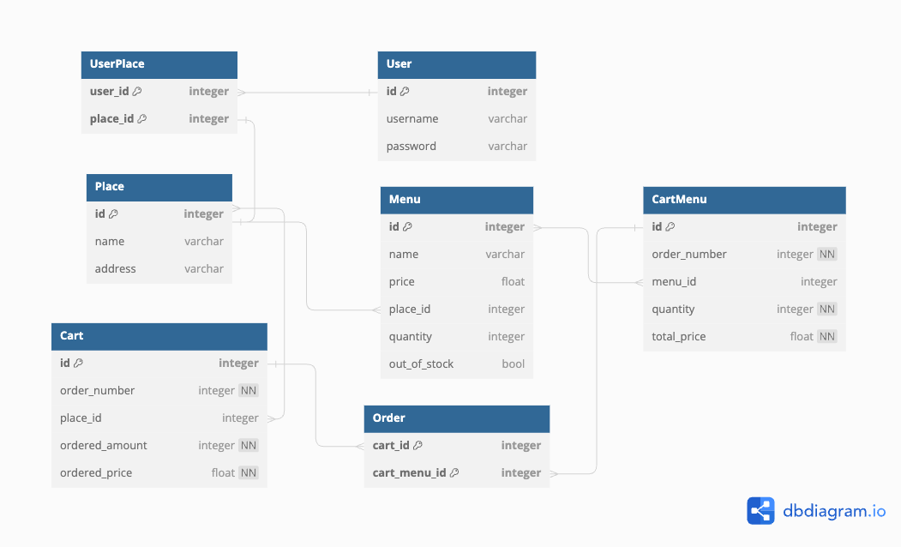
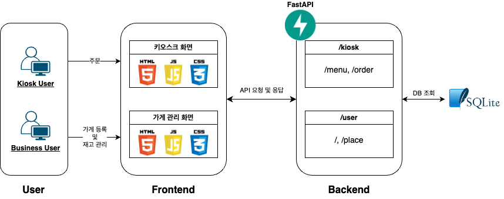

# FastAPI로 구현하는 키오스크

## Framework
### 백엔드
- Language: Python
- Framework: FastAPI
- Database: SQLite

## ERD


## How to start server
```
uvicorn apis.main:kiosk --reload  
```

## System Architecture



## Reference
- 아임포트 결제 연동 - <a href="https://www.inflearn.com/course/%ED%8C%8C%EC%9D%B4%EC%8D%AC-%EC%9E%A5%EA%B3%A0-%EC%95%84%EC%9E%84%ED%8F%AC%ED%8A%B8-%EA%B2%B0%EC%A0%9C/dashboard">파이썬/장고로 결제 시작하기 (Feat.아임포트) - 기본편